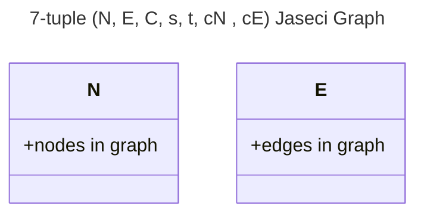

# [Jaseci](https://docs.jaseci.org/) Ninja Notes - 🚧 Work In Progress 🏗

- *These are only my notes, not official docs here, official docs are found in the link provided above*

<p align="left"> 
 

</p>

## My notes from learning Jaseci runtime and Jac programming language

[reference: Jaseci Bible](https://github.com/Jaseci-Labs/jaseci/raw/main/support/bible/pdf/jaseci_bible.pdf)

```yml
Jaseci Graph described as a 7-tuple (N, E, C, s, t, cN , cE ), where:
```


